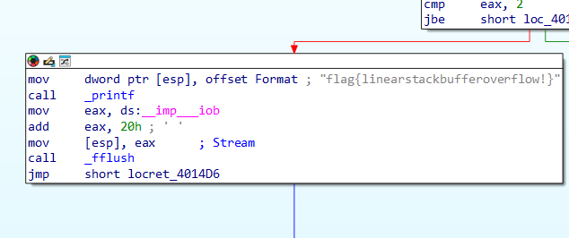
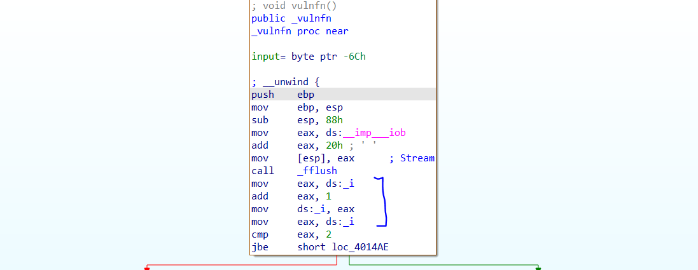
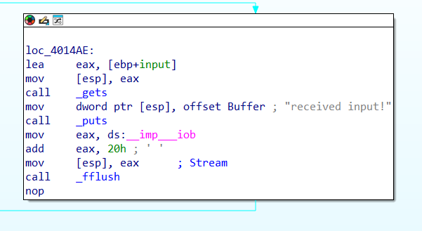
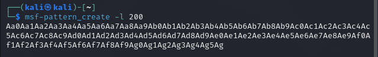
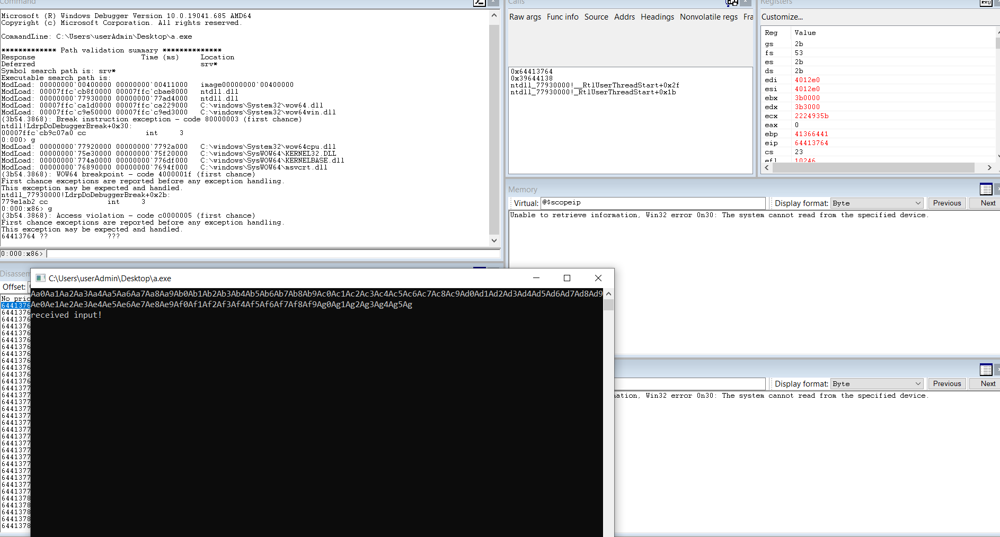
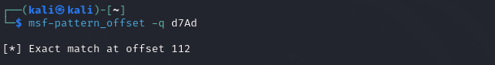

The purpose of this program is to get to the function by going to the flag.

By using ida, we can see the final goal.

In order to reach the flag, we will see that there is a compare command in eax

There is an update of the ds:_i variable and then adding by one. This variable would then be used to determine what branch to go to.

We can put a breakpoint around the area where the ds:_i variable gets updated.

Once we run the program, we can see that the initial variable of ds:_i is 0 when the breakpoint is reached, and we need the variable to be 2 for it to go another branch.

There is also the vulnerable function gets command that is in the function.

We can make use of this function to overwrite the address so that we can increment ds:_i variable so that the prgram execution will reach another branch.

First, we will need to find the offset of the return address.
We can do so by putting in metasploit pattern.

We can use windbg to monitor where is the return address.

To solve this, everytime the program ask for input, place in the crafted input and the flag will be printed out on the console.

