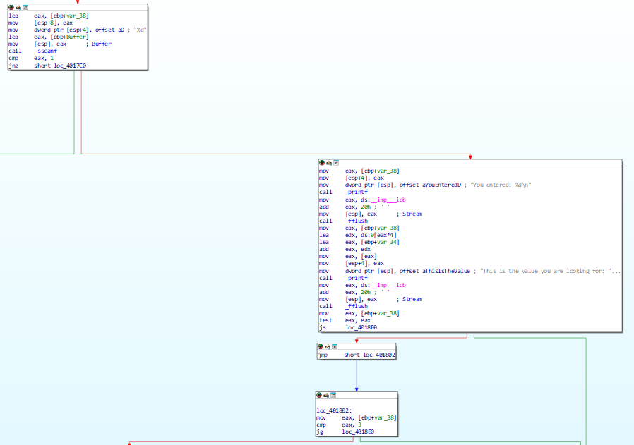
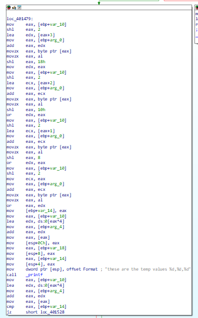
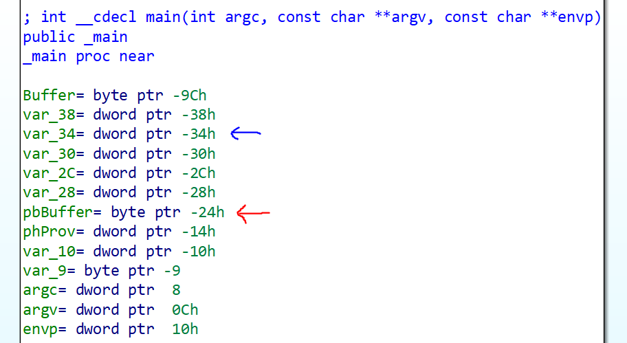

This challengs is to get the input match with the values that are randomly generated. A 16 byte array of values have been generated and you would have to match it.

The vulnerability is overhere where there is an arbirary pointer which can point anywhere in the memory with respect to an address.

In the _submit function, it shows how the given values are being compared.

The blue arrow is the address where the default pointer is and the red is where the random value generated.

So by inputting values that are out of the recommended values can allow users to see values that are out of the recommended regions.

