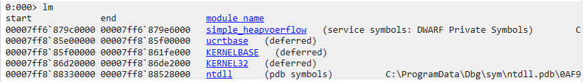
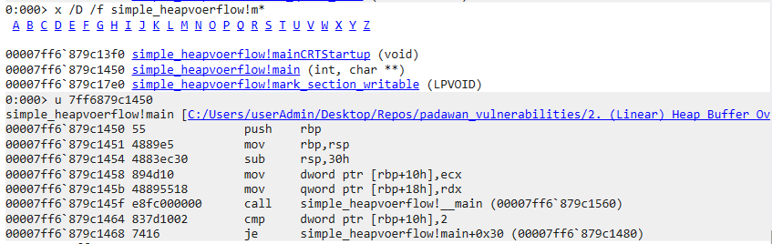
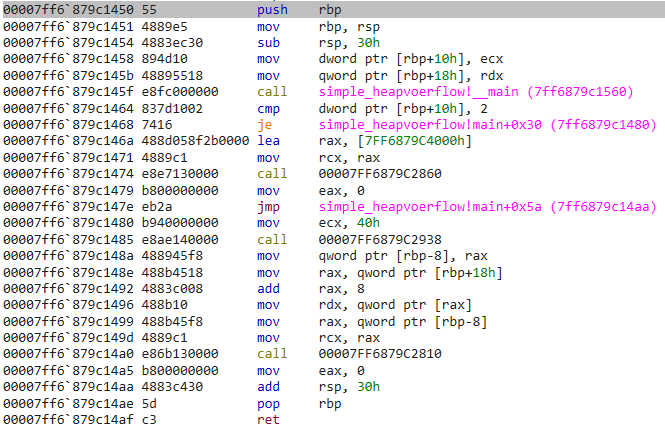
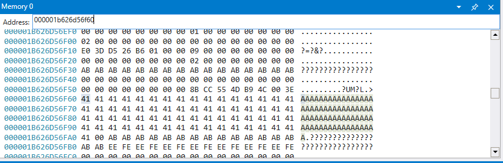
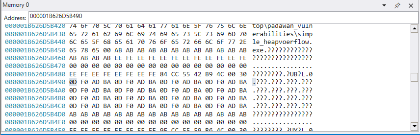
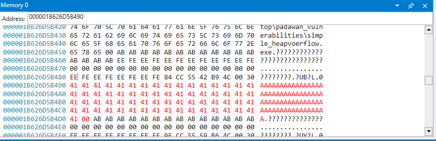

# Heap Buffer Overflow Writeup

## Program Description
This program is a simple toy application that consists of a (Linear) Heap Buffer Overflow vulnerability. Trigger the heap buffer overflow and document down the steps to confirm that the vulnerability is triggered using windbg. This application is not directly susceptible to RCE.

## Program Information
Filename : simple_heapoverflow.c 

Compilation : gcc -O0 -g -fno-stack-protector -fno-pic -D_FORTIFY_SOURCE=0 -o simple_heapvoerflow.exe simple_heapoverflow.c

```
-O0: This flag tells GCC to disable optimizations. Without optimizations, the code will be compiled exactly as you wrote it, making debugging and analysis easier.

-g: Includes debugging information to help if you need to analyze the program in a debugger.

-fno-stack-protector: Disables stack protection, which normally adds guard values to detect stack overflows.

-fno-pic: Disables position-independent code, which can sometimes provide added security by randomizing memory locations.

-D_FORTIFY_SOURCE=0: Disables additional buffer overflow protections that may be enabled by default in newer versions of GCC (like memcpy and strcpy safety checks).
```

## Author Writeup
### Writeup Description
The main vulnerability that should be identified is the use of **strcpy** to directly copy user input, into a memory location that has a fixed heap size initialized using **malloc**.

In this example, the application takes in a user input as a command line argument and does a simple strcpy to another memory location. It can be seen that the toy application does not have any sanity checks or boundary checks which would allow a user to input an arbitrary number of inputs. The fixed sized of the heap is fixed to 64 characters. 

Therefore, a heap buffer overflow may occur if the user input is larger than 64 characters.

### Step By Step
This section documents the steps that can be taken, and the memory locations that should be looked out for, in order to identify that the vulnerability exists in the application, using windbg.

Load the application in windbg with the relevant arguments.  
```E.g. simple_heapoverflow.exe AAAAAAAAAAAAAAAAAAAAAAAAAAAAAAAAAAAAAAAAAAAAAAAAAAAAAAAAAAAAAAAAA```

#### Step 1 : Identify that the module is loaded
Using ```lm``` we can identify that the application has been loaded, along with the address that it has been loaded with.  



From here, it can be seen that the application was loaded at address ```00007FF6879C0000```.

#### Step 2 : Find the application's main function
The next step is to identify the main function that executes the main program of the code. This can be done by simply clicking on the links highlighted from the previous step ```simple_heapvoerflow > Functions > m``` or using the command ```x /D /f simple_heapvoerflow!m*```. The resultant will provide a list of functions that start with the letter **m**. Of which, main is within the output.



From here, it can be seen that the main function is located at address ```00007FF6879C1450```.

#### Step 3 : Understand the instructions that were being done

Now that we know where the main function is located, we can then go to that location and read the disassembly of the expected lines of code that will be executed for this application. Additionally, we can make use of the source code as a reference to what is the intended sequence of instructions.

#### Disassembly


#### Source Code
``` 
int main(int argc, char **argv){

    if (argc != 2){
        printf("Please have an input.\n");
        return 0;
    }
        
    
    char *buf;
    buf = (char *)malloc(sizeof(char) * 64);
    strcpy(buf, argv[1]);
    
    return 0;
}
```

Since we know that the important point of this exercise is to identify that the user input is able to overflow in the heap, we can narrow down the relevant instruction to the use of strcpy. This is the line ``` call 00007FF6879C2810```.

```
To note, Jz says that this might be due to a compiler thing, we might consider changing the way we compile / create symbols, so that these instructions can be represented in a easier way to identify the function.
```

#### Step 4 : Proof that the heap has with more characters than expected
To visually identify that the vulnerability has been triggered, a couple steps are required to be done. 
- Check the contents of the heap before strcpy
- Check the contents of the heap after strcpy

We must first step through to the point where the arugments for **strcpy**  are setup. From there we can identify the memory location that is in use to copy the user input into. This can be identified by the line ``` ```

It can be seen that the user input is stored at ``` 000001B626D56F60 ```, we can confirm this step when we step into the instruction ``` mov     rdx, qword ptr [rax] ```.




It can be seen that the allocated heap locaion is at ``` 000001B626D5B490 ```, we can confirm this step when we step into the instruction ``` mov     rax, qword ptr [rbp-8] ```.



We can then step over the **strcpy** call and look at the allocated heap again.




We can see that the allocated space has been filled with the user's input of 65 A's. The vulnerability can be identified in this case, due to the additional A that has been input. The malloc preivously was only supposed to allocated for 64, however, 66 bytes were input (1x 'A' and '0x00'). 

## References
https://github.com/cheese-hub/Heap-Overflow

## Some notes for future improvments
Consider using the references, to create applications that can result in a win/lose result (CTF-ish)