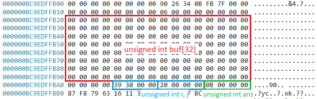

# Out Of Bounds Writes Writeup

Author: jz

## Program Description
This program is a simple toy application that consists of a (Non-Linear) Out-Of-Bounds Writes vulnerability. Trigger the vulnerability and document down the steps to confirm that the vulnerability is triggered using windbg. This application is not directly susceptible to RCE, however, a success condition can be reached with the proper exploitation of this vulnerability.

## Program Information
Filename : simple_oobw.c 

Compilation : gcc -O0 -g -fno-stack-protector -fno-pic -D_FORTIFY_SOURCE=0 -o simple_oobw.exe simple_oobw.c

```
-O0: This flag tells GCC to disable optimizations. Without optimizations, the code will be compiled exactly as you wrote it, making debugging and analysis easier.

-g: Includes debugging information to help if you need to analyze the program in a debugger.

-fno-stack-protector: Disables stack protection, which normally adds guard values to detect stack overflows.

-fno-pic: Disables position-independent code, which can sometimes provide added security by randomizing memory locations.

-D_FORTIFY_SOURCE=0: Disables additional buffer overflow protections that may be enabled by default in newer versions of GCC (like memcpy and strcpy safety checks).
```

## Author Writeup
### Writeup Description
The main vulnerability that should be identified is the capability of the user to provide user input to specifically **overwrite specific memory segments** in the stack. Due to no sanitization checks in the code, the vulnerability exists due to poor coding practices.

In this example, the application takes in 2 user inputs as command line arugments, which represents the index of the position of the array variable and the value to be put in the array. Using this capability, the attacker would be able to specifically provide certain inputs to trigger the if-else success condition.

Hence, if the input for the index is 35 and whilst the value is 1337, the success condition will be hit.

### Step By Step
This section documents the steps that can be taken, and the memory locations that should be looked out for, in order to identify that the vulnerability exists in the application, using windbg.

Load the application in windbg with the relevant arguments.  
```E.g. simple_oobw.exe 32 12345```

#### Step 1 : Identify that the module is loaded
Using ```lm``` we can identify that the application has been loaded, along with the address that it has been loaded with.  


From here, it can be seen that the application was loaded at address ```7FF7333E0000```.

#### Step 2 : Find the application's main function
The next step is to identify the main function that executes the main program of the code. This can be done by simply clicking on the links highlighted from the previous step ```simple_oobw > Functions > m``` or using the command ```x /D /f simple_oobw!m*```. The resultant will provide a list of functions that start with the letter **m**. Of which, main is within the output.


From here, it can be seen that the main function is located at address ```7FF7333E1450```.

#### Step 3 : Understand the instructions that were being done
Now that we know where the main function is located, we can then go to that location and read the disassembly of the expected lines of code that will be executed for this application. Additionally, we can make use of the source code as a reference to what is the intended sequence of instructions.

#### Disassembly

The above provided is only a portion of the main disassembled code, use the ```disassembly``` window in windbg with the main address to view the entire disassembly, or the command ```uf 7FF7333E1450```

#### Source Code
``` 
int main(int argc, char **argv){

    if (argc != 3){
        printf("Program is expecting 2 input arguments.\n");
        printf("E.g. simple_oobw.exe 5 AAAAAAAA\n");
        return 0;
    }

    unsigned int ans = 11;
    unsigned int buf[32] = {0} ;
    unsigned int i = atoi(argv[1]);
    unsigned int j = atoi(argv[2]);

    buf[i] = j;

    printf("Value %s placed in buf[%s] \n", argv[2], argv[1]);

    if(ans == 1337){
        printf("Success!");
    }

    return 0;
}
```

The important point of this exercise is to identify that the user input value is able to be placed outside the bounds of the initialized array. In this application, it can be seen that the attacker would be able to specify the index that the attacker would like to write to and the value to be written. ```i = index, j = value```. 

Of which, these variables are ACID. Thus, we will be able to control and manipulate these values to what we desire.

#### Step 4 : Proof that the user input can be put Out-of-Bounds of the buf array
Based on the understanding of the code, we should be able to identify that the variables are placed in the stack. As such, when we look into the variables placed on the stack.

##### Stack after variable initialization
We first step through to the point where all the variables are initializated. The initialization for all the variables are done **at** the instruction ```mov     dword ptr [rbp-0Ch], eax```. In this example, the address of the stack is at ```000000BC9EDFFB00```.


As we can see, upon initialization of the array, the values in the memory location storing the contents of the ```buf``` array has been zeroed out. Along with the other variables that have been put on the stack. 

##### Contents of the stack after storing user input
Continue stepping through the code and you will see that the input is then placed within the array, based on the user input that is applied. In the example, the input was ```32 12345```. This would result in the assignment of the array at index 5, with the value 12345. In essence, resulting to ```buf[32] = 12345```. 


As we can see, our input (```12345 == 0x3039```) has been written into memory, despite it not being within the "bounds" of the initialized array.

With the above understanding, we are now able to continue with the exploitation of the vulnerability, specifically on the `ans` variable and the relative memory address that should be modified to trigger the success condition.

#### Step 5 : Trigger the success condition
Given that the attacker has write-what-where, the attacker can specifically change the value of the local variable ```ans```, such that the success if-else condition is triggered.



With the memory layout, the attacker could potentially manipulate this capability by viewing the stack differently.


Based on the memory layout we have identified, the variable that we would like to modify is the ```ans``` variable which can be seen to be 12 bytes after the ```buf``` array. This memory address can be reached by simply writing over the bounds of the array index. In this case, that would be at index 35 of buf (```buf[35] = 1337```) with the value ```1337``` would cause the ```ans``` variable to be overwritten to the expected value to trigger the success condition.


## References
\-

## Some notes for future improvments
- Similar to (2), the assembly looks different from the examples practiced in earlier codes from other courses in padawan.
- Can consider to do this in the heap as well, rather than simple on the stack.