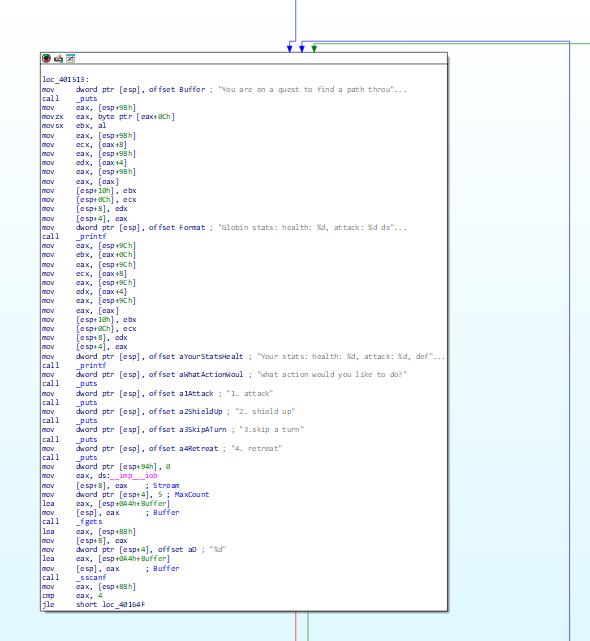
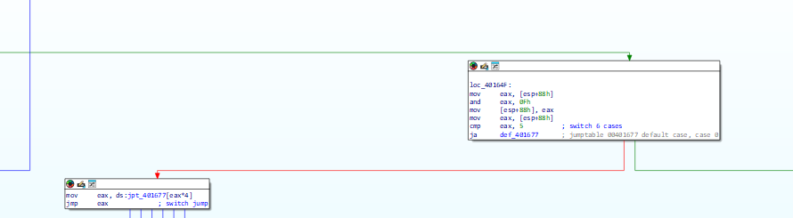

The goal of this challenge is to get the flag by using the correct path, by running the program, it seems that we would need to defeat globin in one turn, ie globin health <= 0.

After dissambling with ida, we can see that our final goal is over here.

Based on the program it seems that 2 objects are being created using calloc. And below the calloc commands are all the initialised values.

When running the program, it seems that the data of the input is stored in esp+88h.

The data is then being processed before sending to the switch case statement.

These are the winning and losing conditions:

We need to prevent eax after {mov eax, [esp+9Ch] ; mov eax, [eax+0Ch]} to be > 0 to prevent exiting or let eax after {mov eax, [esp+98h]; mov eax, [eax]} to be equal to 0.

The first eax is set to 1 and the second eax is set to relevant value based on the input being placed inside.

Based on the code, case 1 modify both eax, while case 5 only modify eax after {mov eax, [esp+98h]; mov eax, [eax]} .

Since case 5 can only make the second eax to one, we can use case 1 to reduce it to 0 and our flag would be printed.

With suitable values, flag is printed.

