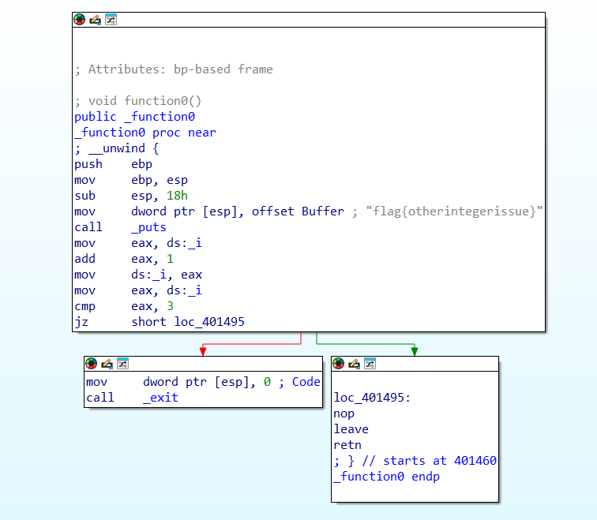
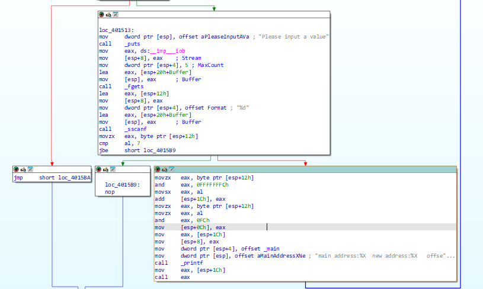
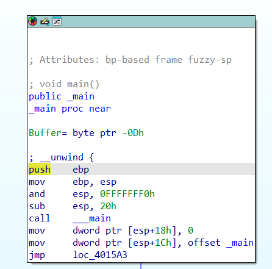
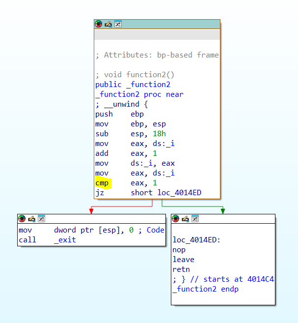
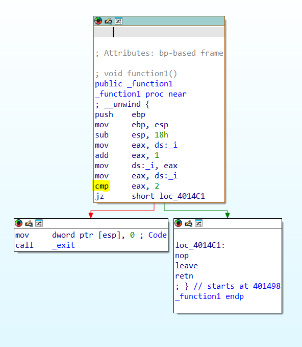
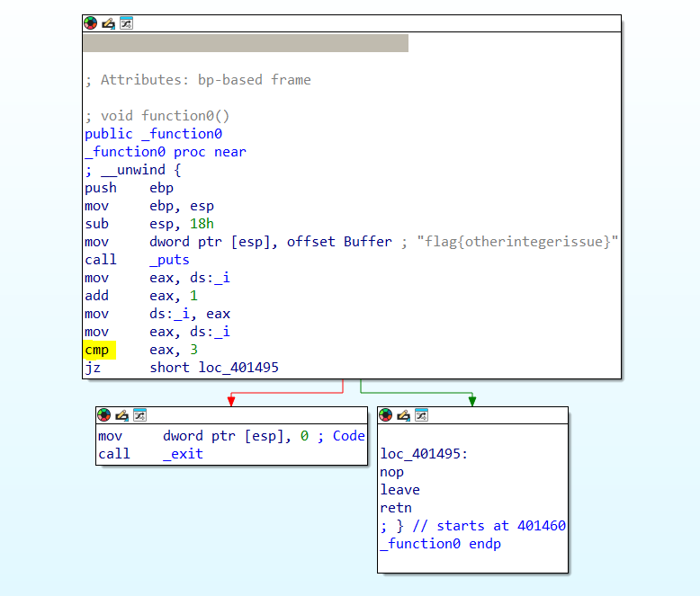
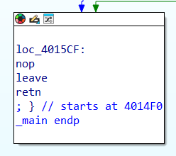

The purpose of this challenge is to get the flag given the input.

First we can disassemble the file given using ida. From ida, we can see the flag inside _function0, which is the function generated by the program.

The condition is that the value ds:_i would have to reach 3. We would need to find some functions that can increment the ds:_i value.

In the _main function, we can see that value stored in esp+1Ch is offset _main. Then the main program will take our input, transform by xor with 0FFFFFCh then sign extend by taking one byte off the eax. Next, it will call the resultant address using the `call eax` instruction.

<!--  -->

Based on analysing the code, the ds:_i starts from 0, and it will increment to 1 in _function0, _function1 and _function2.
The exit condition for those 3 functions are different too.

For _function2 the exit condition is when ds_i is not 1.

For _function1, the exit condition is when ds_i is not 2.

For _function0, the flag is printed when ds_i is 3.

And from those images we can also deduce the addresses of all the functions.

Therefore we would need to jump from _function2 to _function1 to _function0.

The address of main is 004014F0

The address of _function2 is 004014C4
The address of _function1 is 00401498
The address of _function0 is 00401460

and by finding the offset between the _functions and the main, we can jump to the next function, before it is being called.

Since there is only 5 characters, we can input only up to 3 characters for the number we write into the console. (The fourth character is for \n and the last character is for null)

We have to find a character when xor with 0xFC, it would give a negative value, as it would need to go to an address of lower than the main address.

Integer overflow (char overflow in this case) would need to be done.

The offset between the main and _function2 is 0x2C and we have to negate it, which will be 0xD4 which is char value 212 if convert to unsigned integer.
The offset between the _function2 and _function1 is 0x2C and we have to negate it, which will be 0xD4 which is char value 212 if convert to unsigned integer
The offset between the _function1 and _function0 is 0x38. The negation of the value would be 0xC8 which would be 200 when convert to unsigned integer.

So the possible solutions is 212, 212 and 200 respectively.

 

