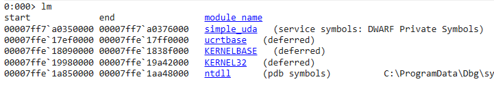
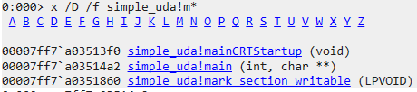
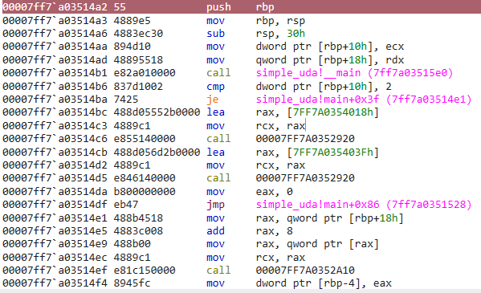
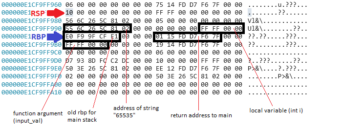
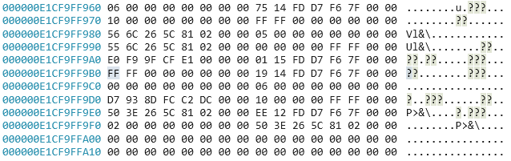
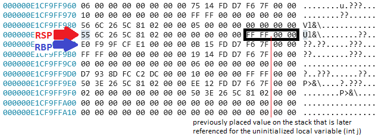
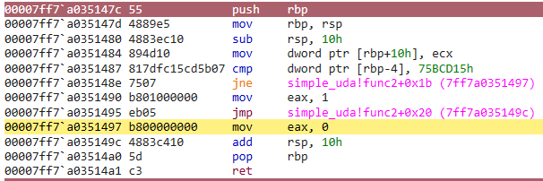

# Uninitialized Data Access Writeup

Author: jz

## Program Description
This program is a simple toy application that consists of a Uninitialized Data Access vulnerability. Trigger the vulnerability and document down the steps to confirm that the vulnerability is triggered using windbg. This application is not directly susceptible to RCE, however, a success condition can be reached with the proper exploitation of this vulnerability.

## Program Information
Filename : simple_uda.c 

Compilation : gcc -O0 -g -fno-stack-protector -fno-pic -D_FORTIFY_SOURCE=0 -o simple_uda.exe simple_uda.c

```
-O0: This flag tells GCC to disable optimizations. Without optimizations, the code will be compiled exactly as you wrote it, making debugging and analysis easier.

-g: Includes debugging information to help if you need to analyze the program in a debugger.

-fno-stack-protector: Disables stack protection, which normally adds guard values to detect stack overflows.

-fno-pic: Disables position-independent code, which can sometimes provide added security by randomizing memory locations.

-D_FORTIFY_SOURCE=0: Disables additional buffer overflow protections that may be enabled by default in newer versions of GCC (like memcpy and strcpy safety checks).
```

## Author Writeup
### Writeup Description
The main vulnerability that should be identified is the capability of the user to provide user input that will be **reused** in the stack. Due to the lack of variable initialization, it this allows for the potential of pre-allocating variables with values that were previously placed on the stack.

In this example, the applicaiton takes in 1 user input through the command line argument. This value will then be stored and used throughout the application. Specifically, it will be reused in ```func2``` where a local variable was not initialized. Hence, resulting in a uninitialized data access vulnerability.

As long as the value ```123456789``` has been placed in the stack by another function before the invocation of ```func2```, this value will then become the new value for the variable in ```func2```.


### Step By Step
This section documents the steps that can be taken, and the memory locations that should be looked out for, in order to identify that the vulnerability exists in the application, using windbg.

Load the application in windbg with the relevant arguments.  
```E.g. simple_uda.exe 65535```

---
#### Step 1 : Identify that the module is loaded
Using ```lm``` we can identify that the application has been loaded, along with the address that it has been loaded with.  



From here, it can be seen that the application was loaded at address ```7FF7A0350000```.

---
#### Step 2 : Find the application's main function
The next step is to identify the main function that executes the main program of the code. This can be done by simply clicking on the links highlighted from the previous step ```simple_uda > Functions > m``` or using the command ```x /D /f simple_uda!m*```. The resultant will provide a list of functions that start with the letter **m**. Of which, main is within the output.



From here, it can be seen that the main function is located at address ```7ff7A03514A2```.

---
#### Step 3 : Understand the instructions that were being done
Now that we know where the main function is located, we can then go to that location and read the disassembly of the expected lines of code that will be executed for this application. Additionally, we can make use of the source code as a reference to what is the intended sequence of instructions.

#### Disassembly

The above provided is only a portion of the main disassembled code, use the ```disassembly``` window in windbg with the main address to view the entire disassembly, or the command ```uf 7ff7a03514a2```

#### Source Code
``` 
void func1(int input_val){
    int i = input_val;
    printf("This is the i = %d \n", i);
}

int func2(int input_val){
    int j;
    if(j == 123456789){
        return 1;
    }    
    else{
        return 0;
    }
}

int main(int argc, char **argv){

    if (argc != 2){
        printf("Program is expecting 1 input argument.\n");
        printf("E.g. simple_uda.exe AAAA\n");
        return 0;
    }
    
    unsigned int user_input = atoi(argv[1]);

    func1(user_input);

    int outcome = func2(user_input);

    if(outcome)
        printf("Success\n");

    return 0;
}
```

The important point of this exercise is to identify that the user input remains in the stack, after each function. This is due to how the stack works, where the values remain in the stack's memory address but the stack pointer changes. In this vulnerability, due to the variable being initialized in ```func1```, before ```func2``` is called, whilst another variable has been declared, it was not initialized in the code. 

Of which, the declaration had then resulted in the variable ```j``` to take up the value that was on the stack.

---
#### Step 4 : Proof that the user input is in the stack and used in the declared variable j
Based on the understanding of the code, we should be able to identify that the variables are placed in the stack. As such, when we look into the variables placed on the stack. To visualize the vulnerability being triggered, we will have to step through the main code and how the stack frame switches between each function call.

##### Stack layout in func1
Upon stepping into the call of func1 (which can be seen by stepping into the instruction ```call    simple_uda!func1 (7ff6d7fd1450)``` ), we can see that the stack frame has been shifted from the main stack frame. This can be seen from the function prologue (set up of RSP and RBP for new stack frame in function).

RSP = ```000000E1CF9FF970```  
RBP = ```000000E1CF9FF9A0```



Based on the assembly in func1 it can be seen that the variable ```int i``` is referenced by ```rbp-4``` which is the value ```0xFFFF == 65535```. This memory location should be look out for throughout each step.


##### Stack layout in main
Stepping out of func1, we will be be back into the main function. The RSP and RBP have been reset to what it was previously was after the function epilogue (stack clean up).

RSP = ```000000E1CF9FF9B0```  
RBP = ```000000E1CF9FF9E0```  


Based on the layout, we can see that there is not many changes in the stack as there are no instructions that manipulates the stack between each function.

##### Stack layout in func2
Stepping into func2, we can see that the stack frame has been set up in about the same location as the stack frame that was set up in func1 after the function prologue. 

RSP = ```000000E1CF9FF990```  
RBP = ```000000E1CF9FF9A0```


We can see that the RBP in this stack frame is the same as when it was in Func1. The values on the stack that are used in func2 were very similar or nearly the same as those that were set up in func1. However, the important difference was that in the C code, the variable ```int j``` was not initialized with any value.


We can see that in the func2 disassembly, it makes use of the instruction ```cmp     dword ptr [rbp-4], 75BCD15h``` to check against the success condition. When the ```cmp``` instruction is compared against ```[rbp-4]```  it is actually using the value that was previously used in Func1, as opposed to a new local variable.


#### Step 5 : Trigger the success condition
As we have identified in the preivous step, we can achieve the success condition by simply providing the correct value that is checked in the if-else condition in func2. In that regards, the expected answer is the string "123456789". As such providing that number as the program input would result in the success condition.


## References
\-

## Some notes for future improvments
- Similar to (2), the assembly looks different from the examples practiced in earlier codes from other courses in padawan.
- Can consider to do this in the heap as well, rather than simple on the stack.