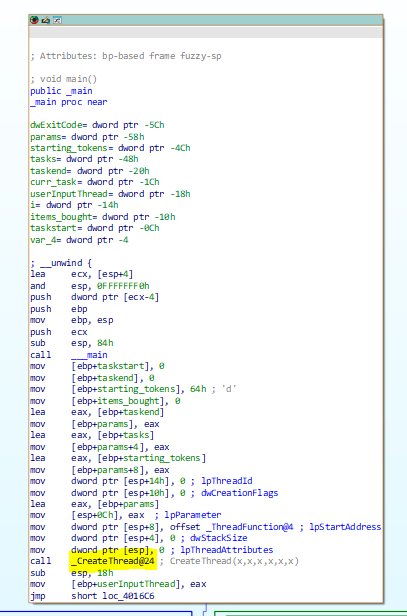
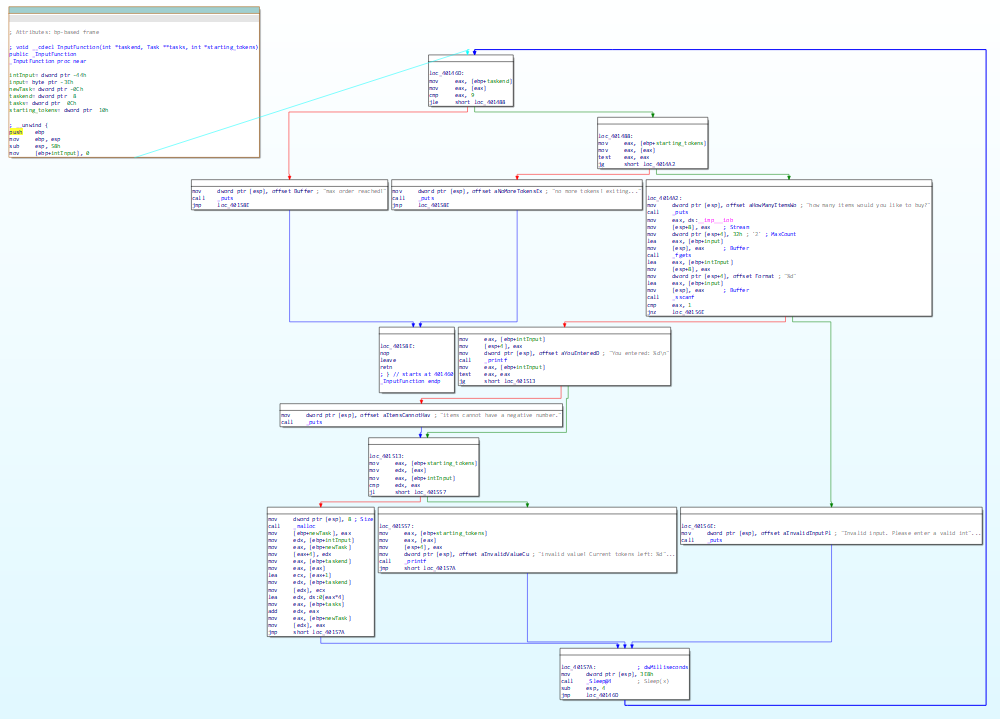
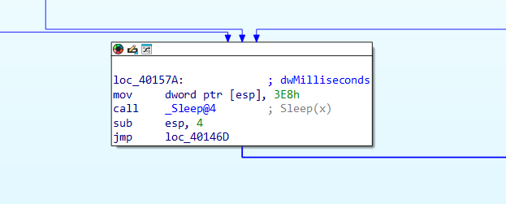
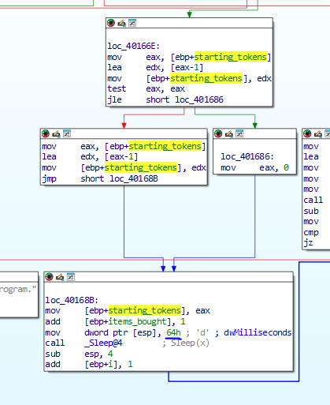

This has the race condition vulnerability. 

Given 100 tokens we need to "purchase" more than or equal to 500 items, and each item costs 1 token.

We can try to input values inside the console that run the program, and we can see that we can input multiple values, which could easily add up to more than 100.

There is a _createThread function helps to create a thread that deals with the input function


Above is a portion of assembly code inside the main function.

This _CreateThread function called _ThreadFunction, which spawns a seperate thread. the _ThreadFUnction then calls the InputFunction before exiting.

Based on the strings and assembly of the Input function code, it seems that it require an integer as a value and the value would need to be more than or equal to the current tokens. Between every input, there is a 1 second timeout. 





The current tokens is stored in [ebp+starting_tokens] value. We can go back to the main function to see how it is being used.

In the main function, we can see the [ebp+starting_tokens] is initialised with the variable 100, which is what we can see in the console.



we can see that there is an interval between the deductions of token is 100 ms. So with that we can craft our input such that we can hit the goal of 500 tokens.

One of the soution is as below:

```
100
89
78
67
56
45
34
23
12
1
```


