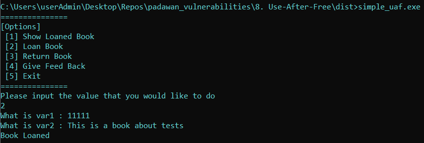
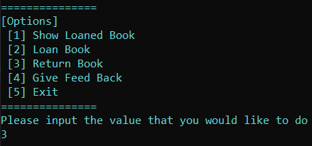
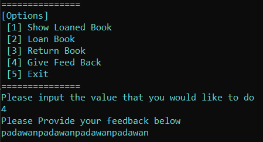
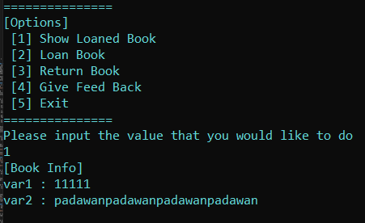
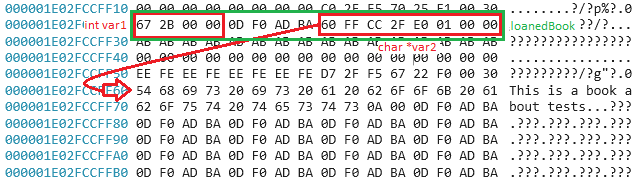

# Uninitialized Data Access Writeup

Author: jz

## Program Description
This program is a simple toy application that consists of a User-After-Free (UAF) vulnerability. Trigger the vulnerability and document down the steps to confirm that the vulnerability is triggered. This application is not directly susceptible to RCE, however, a certain set of actions would result in the evidence that a UAF vulnerability is present.

Do note that the application is buggy and there are multiple possible ways to cause the application to crash.

## Program Information
Filename : simple_use_after_free.c 

Compilation : gcc -O0 -g -fno-stack-protector -fno-pic -D_FORTIFY_SOURCE=0 -o simple_uaf.exe simple_use_after_free.c

```
-O0: This flag tells GCC to disable optimizations. Without optimizations, the code will be compiled exactly as you wrote it, making debugging and analysis easier.

-g: Includes debugging information to help if you need to analyze the program in a debugger.

-fno-stack-protector: Disables stack protection, which normally adds guard values to detect stack overflows.

-fno-pic: Disables position-independent code, which can sometimes provide added security by randomizing memory locations.

-D_FORTIFY_SOURCE=0: Disables additional buffer overflow protections that may be enabled by default in newer versions of GCC (like memcpy and strcpy safety checks).
```

## Author Writeup
### Writeup Description
The main vulnerability that should be identified is the capbility of the user to provide a certain sequence of actions to cause a UAF vulnerability to occur. The UAF vulnerability would result in the outcome of leaked information due to the condition of using a wronly "freed" memory location. This would result in the description of a previously loaned book to be modified even after the book has been returned.

In this example, the application can be exploited by making use of a sequence of actions that are provided within the book loaning application. The specific sequence to show that the UAF vulnerability exists is to 
1. Loan a Book
2. Return a Book
3. Give a FeedBack
4. Show a Loaned Book

This would result in the previously loaned book to show the ```var1``` that was loaded into the first book, along with the new user input from step (3) that resulted in the description to be modified. 


### Step By Step
This section documents the steps that can be taken, and the memory locations that should be looked out for, in order to identify that the vulnerability exists in the application.

Load the application can be run without any arguments.  
```E.g. simple_uaf.exe```

#### Step 1 : Understand the C Code
Before we try to identify the vulnerability in the code. We should try to understand the main use case of the application, along with the source code (or de-compiled code) of how it was written . This is important as it will provide us with better knowledge on the potential attack surface areas that allow us to find vulnerabilities. 

Playing around with the application would allow you to understand that, a user will provided with options and functionalities of the application based on a main switch case. Each switch case would provide for the loaning, returning, giving feedback and exiting functionalities for the application's uses.

```
while(selection != 10){

        print_options();
        printf("Please input the value that you would like to do\n");
        scanf("%d", &selection);

        // This is needed to clear the buffer, so that \n is removed for fgets to work.
        // flushes stdin
        while(getchar() != '\n');

        switch(selection){
            case 1:
                print_struct(loanedBook);
                break;
            case 2:
                loanedBook = malloc(sizeof(struct special_struct));
                loanedBook->var2 = malloc(256);

                printf("What is var1 : ");
                scanf("%d", &loanedBook->var1);

                // This is needed to clear the buffer, so that fgets can work.
                while(getchar() != '\n');

                printf("What is var2 : ");
                fgets(loanedBook->var2, 256, stdin);

                printf("Book Loaned \n");
                break;
            case 3:
                free_struct(loanedBook);
                break;
            case 4:
                char *feedback = malloc(256);
                printf("Please Provide your feedback below \n");
                fgets(feedback, 256, stdin);
                break;
            case 5:
                printf("Exit");
                selection = 10;
            
        }
    }
```

##### Normal Use Case #1 : Loaning, Returning and Giving FeedBack for a Book
For this application, the main use case of the application is to provide a simple library management system to loan and return a book. This is achieved by doing the following steps.
1. Loan a Book
2. Return a Book
3. Leave a FeedBack

At each stage of the process, the user is also able to show the information of the loaned book, through a seperate function, which can be reached through a seperate switch case condition.

###### Loan the book
For a normal user, they would be able to loan a book by entering the switch case ```2```. From there they will be prompted with inputs for ```var1``` and ```var2```.

From ```switch case 2```, we can that the input is used to fill in the data for a allocated special_struct object. This object is basically used to contain information regarding a book.

```
case 2:
    loanedBook = malloc(sizeof(struct special_struct));
    loanedBook->var2 = malloc(256);

    printf("What is var1 : ");
    scanf("%d", &loanedBook->var1);

    // This is needed to clear the buffer, so that fgets can work.
    while(getchar() != '\n');

    printf("What is var2 : ");
    fgets(loanedBook->var2, 256, stdin);

    printf("Book Loaned \n");
    break;
```

Looking deeper into the special_struct, we learn that ```var1``` is expecting an integer value, whilst ```var2``` is a char pointer, which can indicate that it expects a string. Therefore, we can generalize these information as possibly specifying the **BookID** and **a description for the book**. 

```
struct special_struct {
    int var1;
    char *var2; 
};
```
Based on the information that we have gathered, we know that we can then fill in dummy data to create/loan a book. 



In this example, we will make use of a bookID of ```11111``` and description ```This is a book about tests```.

###### Return the book
Once a book has been loaned, it can then be returned. This can be achieved with ```switch case 3```. Doing so does not result in any output. But looking into the code, we can see that it calls the free_struct function.



```
case 3:
    free_struct(loanedBook);
    break;
```

We now can look into the free_struct function to learn about, how exactly it frees the loaned book. 

```
void free_struct(struct special_struct *input_struct){
    free(input_struct->var2);
    free(input_struct);
}
```

As seen in the code snippet above, the special_struct object is freed by simply using the ```free()``` function on the ```char * var2``` and the ```entire struct``` itself. This is correct to free it, however, there was no proper reassignment of the structure. Therefore, this could potentially lead to the use-after-free vulnerability, if this variable was used again.

###### Provide FeedBack
The user also has the functionality to provide a feedback to the system. This can be triggered by making use of ```switch case 4```.



This condition will then request for the user to input a string that will be stored in the variable ```char *feedback```

```
case 4:
    char *feedback = malloc(256);
    printf("Please Provide your feedback below \n");
    fgets(feedback, 256, stdin);
```

For this example, we make use of the string ```padawanpadawanpadawanpadawan```, as the input for the feedback. It is good to take note that this variable is also placed on the heap using the ```malloc()``` function. This could potentially be used to modify/change values in the heap.

#### Step 2 : Test the theorized sequence of actions
Looking through the expected use case, we have been able to indicate that certain functions, when chained together, could potentially lead to a use-after-free vulnerability. In essense, the theorized sequence of actions would be to:
1. allocation of a special_struct
2. de-allocation/freeing of a special_struct
3. allocating another variable in the heap
4. using the old special_struct

When reflecting these expected actions to the functionalities the application is capable of, they can be sequenced as such:
1. Loan a Book
2. Return a Book
3. Give a FeedBack
4. Show the Loaned Book

As such, we can try to make use of this potential vulnerable use case to recreate and show that the use-after-free vulnerability is apparent in this application.

##### Vulnerable Use Case #1 : Loaning , Returning , Giving FeedBack and then showing on a "loaned book".
As we have identified in the previous section, the object (the loaned book) can be returned ("freed"), however, the pointer is not reassigned to ```NULL``` or ```0```. There are no checks to validate that there is a legitimate loaned book.

The first 3 steps are the same as a normal use case that can be seen in the above sections. The main step that needs to be added is the viewing of the "loaned book" after providing a feedback.

###### Show "Loaned Book"
After replicating the steps taken for a normal use case, we can then do a simple ```Show Loaned Book``` functionality from the application, this will successfully show that the vulnerability exists.



Due to the lack of validation and checks, it can be seen that the application was able to use the same object again, despite it being freed. More specifically, we were able to modify the contents of ```var2```, based on the feedback that was provided. This was done due to the fact that ```malloc()``` had actually allocated the same heap location as the string of ```var2``` which was previously freed.



The above image shows the heap and the amount of memory that is allocated for the loanedBook object upon allocation. It can also be seen that ```var2``` has also been allocated in a memory location further down. 

```
At the point of writing, I was not able to replicate the vulnerability to show that the heap was indeed re-allocated at the same memory location upon the use of malloc() when providing a feedback. However, based off the code, we should have been able to identify this process flow, which could lead to the resulting vulnerability.
```


## References
https://ctf101.org/binary-exploitation/heap-exploitation/

## Some notes for future improvments
- Similar to (2), the assembly looks different from the examples practiced in earlier codes from other courses in padawan.
- Can consider to have success condition for the trainee to try to override into, such that it would result in the "freed" book would be modified and used to be exploited. Maybe a checkout system? When if a book's description contained a sequence of characters, it would checkout for free?