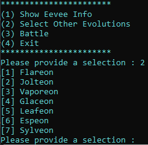
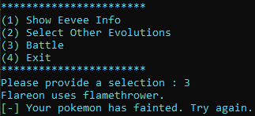
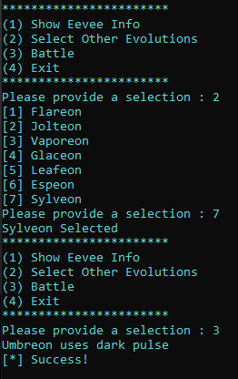

# Type Confusion Writeup

Author: jz

## Program Description
This program is a simple toy application that consists of a Type Confusion vulnerability. Trigger the vulnerability and document down the steps to confirm that the vulnerability is triggered. This application is not directly susceptible to RCE, however, a certain set of actions would allow the attacker to reach the success condition.

Do note that the application is buggy and there are multiple possible ways to cause the application to crash.

## Program Information
Files that are required to compile the application:
- main.cpp
- eevee.cpp
- eevee.h

Compilation : g++ -O0 -fno-stack-protector -D_FORTIFY_SOURCE=0 -fno-pie -fno-strict-aliasing main.cpp eevee.cpp

```
-O0: This flag disables optimizations. 

-fno-stack-protector: This flag disables the stack protection mechanism, which is intended to prevent buffer overflows from overwriting the return address or control data on the stack. 

-D_FORTIFY_SOURCE=0: This flag sets the macro _FORTIFY_SOURCE to 0. This macro controls the level of safety checks for certain functions, particularly those dealing with buffer overflow prevention (like strcpy, memcpy, etc.). 

-fno-pie: This flag disables the creation of Position Independent Executables (PIE). By default, many modern compilers create PIE to enhance security by making it harder for an attacker to predict the addresses of functions and variables in memory (Address Space Layout Randomization, or ASLR). 

-fno-strict-aliasing: This flag disables strict aliasing rules, which specify how different types of pointers can be used to access the same memory location. 
```

## Author Writeup
### Writeup Description
The main vulnerability that should be identified is the Type Confusion vulnerability due to poor coding from the author. The vulnerability would cause in an incorrect type eevee to be instantiated, despite what the's initial intention. This would result in a successful battle against the enemy pokemon. 

In this example, the success condition can be reached by selecting the correct eevee evolution that meets the condition of ```eevee_atk >= opponentmon->hp```. As such, looking into the ```enemy()``` object, we can learn that the opponent's pokemon has 200 HP. Of which the only eevee evolution that has sufficient attack to match the HP listed is Umbreon.

However, in the eevee selection stage, Umbreon cannot be directly selected. Therefore, reading through the code, we will be able to learn that the author had coded the logic of instantiating a Sylveon wrongly, by returning a Umbreon object instead.

Therefore, the success condition can simply be acheived by selecting Sylveon. This makes use of the type confusion that was accidentally coded in the the application, between the Sylveon and Umbreon types.


### Step By Step
This section documents the steps that can be taken, and the memory locations that should be looked out for, in order to identify that the vulnerability exists in the application.

Load the application can be run without any arguments.  
```E.g. simple_type_confusion.exe```

#### Step 1 : Understand the C Code
Before we try to identify the vulnerability in the code. We should try to understand the main use case of the application, along with the source code (or de-compiled code) of how it was written . This is important as it will provide us with better knowledge on the potential attack surface areas that allow us to find vulnerabilities. 

Playing around with the application would allow you to understand that, a user will be provided with options and functionalities of the application based on a main switch case. Each switch case would provide the user with the option to view the current eevee's info, select a different eevee, battle and exit the application.

```
switch(user_option){
            case 1:
                print_eevee_info(currentEevee);
                break;
            case 2:
                print_eeveelutions();
                cin >> eevee_selection;
                currentEevee = returnEeveelution(eevee_selection);
                break;
            case 3:
                if (eevee_selection == 0){
                    currentEevee->tackle();
                    success_condition = battle(currentEevee->atk);
                }
                else if (eevee_selection == 1){
                    Flareon *flareon = static_cast<Flareon*>(currentEevee);
                    flareon->flamethrower();
                    success_condition = battle(flareon->atk);
                }
                else if (eevee_selection == 2){
                    Jolteon *jolteon = static_cast<Jolteon*>(currentEevee);
                    jolteon->thunderbolt();
                    success_condition = battle(jolteon->atk);
                }
                else if (eevee_selection == 3){
                    Vaporeon *vaporeon = static_cast<Vaporeon*>(currentEevee);
                    vaporeon->hydro_pump();
                    success_condition = battle(vaporeon->atk);
                }
                else if (eevee_selection == 4){
                    Glaceon *glaceon = static_cast<Glaceon*>(currentEevee);
                    glaceon->blizzard();
                    success_condition = battle(glaceon->atk);
                }
                else if (eevee_selection == 5){
                    Leafeon *leafeon = static_cast<Leafeon*>(currentEevee);
                    leafeon->solar_blade();
                    success_condition = battle(leafeon->atk);
                }
                else if (eevee_selection == 6){
                    Espeon *espeon = static_cast<Espeon*>(currentEevee);
                    espeon->future_sight();
                    success_condition = battle(espeon->atk);
                }
                else if (eevee_selection == 7){
                    Sylveon *sylveon = static_cast<Sylveon*>(currentEevee);
                    sylveon->alluring_voice();
                    success_condition = battle(sylveon->atk);
                }
                break;
            case 4:
                cout << "[*] Exiting the game.";
                game_ongoing = 0;
                break;
            default:
                cout << "[*] Please Provide a proper selection" << endl;
        }
```

##### Normal Use Case #1 : Selecting a Eevee Evolution and Battling
For this application, the main use case of the application is to simulate a pokemon battle with different eevee evolutions. This is achieved by doing the following steps.
1. Selecting a Eevee evolution
2. Battling

At each stage of the process, the user is also able to show the information of the selected eevee, through a seperate function, which can be reached through a seperate switch case conditon.

###### Selecting a Eevee Evolution
For a normal user, they would be able to select a Eevee evolution by entering the switch case ```2```. From there, they will be prompted to provide another selection, to choose which evolution they would like to select.

```
case 2:
    print_eeveelutions();
    cin >> eevee_selection;
    currentEevee = returnEeveelution(eevee_selection);
    break;
```

Looking deeper into the returnEeveelution() function, we can learn more about which type of Eevee is being returned upon the input of a selection.

```
eevee * returnEeveelution(int selection){

    eevee * selectedEevee;

    switch(selection){
        case 1:
            selectedEevee = new Flareon();
            cout << "Flareon Selected" << endl;
            break;
        case 2:
            selectedEevee = new Jolteon();
            cout << "Jolteon Selected" << endl;
            break;
        case 3:
            selectedEevee = new Vaporeon();
            cout << "Vaporeon Selected" << endl;
            break;
        case 4:
            selectedEevee = new Glaceon();
            cout << "Glaceon Selected" << endl;
            break;
        case 5:
            selectedEevee = new Leafeon();
            cout << "Leafeon Selected" << endl;
            break;
        case 6:
            selectedEevee = new Espeon();
            cout << "Espeon Selected" << endl;
            break;
        case 7:
            selectedEevee = new Umbreon();
            cout << "Sylveon Selected" << endl;
            break;
    }
    return selectedEevee;
}
```
Based on the information that we have gathered, we know that upon the user's input, a pointer to a newly created evolution's object will be up casted to a eevee pointer object, which will later then be returned. It is here that we realized that, for switch case 7, the author had used the wrong object for a given evolution. 



###### Battling
Once an evolution has been selected, it can then be used for battling. This can be achieved with ```switch case 3```. Doing so would result in the selected eevee being down casted into the specific type that it was expected to be. Each eevee will then do their expected attacks before calling the battle() function.



```
case 3:
    if (eevee_selection == 0){
        currentEevee->tackle();
        success_condition = battle(currentEevee->atk);
    }
    else if (eevee_selection == 1){
        Flareon *flareon = static_cast<Flareon*>(currentEevee);
        flareon->flamethrower();
        success_condition = battle(flareon->atk);
    }
    else if (eevee_selection == 2){
        Jolteon *jolteon = static_cast<Jolteon*>(currentEevee);
        jolteon->thunderbolt();
        success_condition = battle(jolteon->atk);
    }
    else if (eevee_selection == 3){
        Vaporeon *vaporeon = static_cast<Vaporeon*>(currentEevee);
        vaporeon->hydro_pump();
        success_condition = battle(vaporeon->atk);
    }
    else if (eevee_selection == 4){
        Glaceon *glaceon = static_cast<Glaceon*>(currentEevee);
        glaceon->blizzard();
        success_condition = battle(glaceon->atk);
    }
    else if (eevee_selection == 5){
        Leafeon *leafeon = static_cast<Leafeon*>(currentEevee);
        leafeon->solar_blade();
        success_condition = battle(leafeon->atk);
    }
    else if (eevee_selection == 6){
        Espeon *espeon = static_cast<Espeon*>(currentEevee);
        espeon->future_sight();
        success_condition = battle(espeon->atk);
    }
    else if (eevee_selection == 7){
        Sylveon *sylveon = static_cast<Sylveon*>(currentEevee);
        sylveon->alluring_voice();
        success_condition = battle(sylveon->atk);
    }
    break;
```

At this point, we can then look into the battle() function as well. As explained in the description, the battle function will compare the current selected eevee against a opponentmon that is created. It will compare between the opponentmon's HP and the attack stat of the selected eevee.

```
int battle(int eevee_atk){
    enemy * opponentmon = new enemy();

    if(eevee_atk >= opponentmon->hp){
        cout << "[*] Success!" << endl;
        return 1;
    }
    else{
        cout << "[-] Your pokemon has fainted. Try again." << endl;
        return 0;
    }
}
```

Looking at the enemy object, we can then learn that the expected HP to beat is **200**.

```
class enemy {
    public:
        int hp = 200;
        int atk = 300;
        int def = 0;

        enemy();
};
```

As such, to successfully trigger the success condition, we will require an eevee evolution with an ATK of at least 200. Of which, only Umbreon is able to achieve that value.


#### Step 2 : Test the theorized selection
Looking through the conditions required to trigger the success case, we have identified that the eevee evolution that we required is the one with 200 ATK. This can only be satisfied with the use of the Umbreon evolution.

We have also identified that the author of the code had accidentally made use of the Umbreon type upon the creation of a Sylveon type. The Umbreon type was first up casted into an eevee before being down casted to be a Sylveon. Therefore, we can simply select the Sylveon type and battle. This would allow for the success condition to be set and triggered.


##### Vulnerable Use Case #1 : Selecting Sylveon and Battling
Simplying running the application, and then selecting the Sylveon eevee evolution type, followed by battle would result in the success condition, while also exiting the application.



## References
- https://www.youtube.com/watch?v=SIAuhzQqAow

## Some notes for future improvments
- Similar to (2), the assembly looks different from the examples practiced in earlier codes from other courses in padawan.
